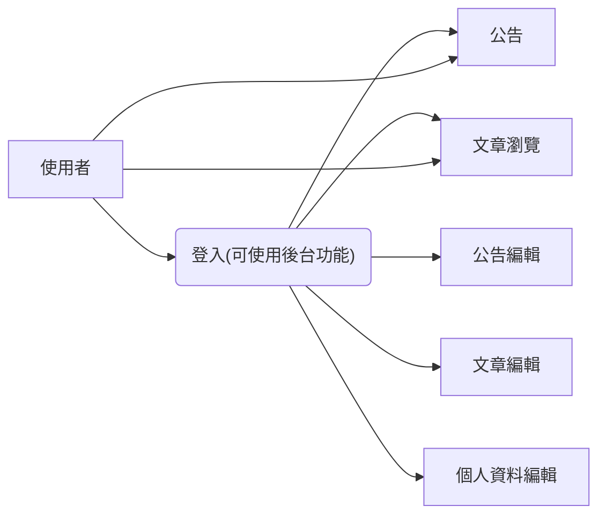

## 猴子都會的部落格

### 專案目錄
* package-lock.json

  * gulpfile.js

  * package.json

  * README.md

  * final (此為整個網站的根目錄)

    > 前台各頁面的php，這裡的php為容器，會從component引入共用php、從content引入頁面內容 

    * component

      * endOfBody.php (前台各頁面 <body> 最下方共用的 html)
      * head.php (前台各頁面中 <head> 共用的 html)

    * content

      > 前台各頁面的html

    * css

      > 前台各頁面的css

    * dashboard (後台資料夾)

      > 後台各頁面的php

      * content

        > 後台各頁面的php檔

      * css

        > 後台各頁面的css

      * function

        > 後台後端的php，例: 資料庫連線code

      * img

        > 後台前端有用到的圖檔
* source             
  
  > 經由後台上傳的檔案放置位置，例如圖片、影片...             
* download         
  
  > 前台供使用者下載的檔案的放置位置         
* img         
  
  > 前台各頁面圖檔放置的資料夾          
* js          
  
  > 前台各頁面的js          
* plugin           
  
  > 前端library          
* less      
  > 前台的less
	* dashboard
	  
	  > 後台的less
      * js

### 流程圖

### 未來發展方向

1. 前端改為 vue
2. 後端使用 Laravel

      * plugin

        > 後台前端用到的library

  * source             
    > 經由後台上傳的檔案放置位置，例如圖片、影片...             
  * download         
    > 前台供使用者下載的檔案的放置位置         
  * img         
    > 前台各頁面圖檔放置的資料夾          
  * js          
    > 前台各頁面的js          
  * plugin           
    > 前端library          
  * less      
    > 前台的less
    * dashboard
      > 後台的less
      
2. 未來可能發展方向：
    * 前端改為 vue
    * 後端使用 Laravel
    * PWA